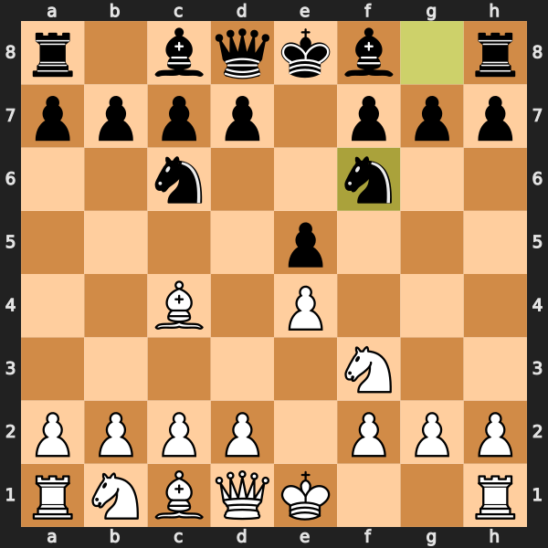

# ♔ Шаховий Бот ♚

Професійний шаховий бот з рушієм **Stockfish**, що грає на різних рівнях складності - від дитячого до гросмейстерського. Повна підтримка української мови!



> 💡 **Рекомендація**: Для найкращої візуалізації використовуйте **iTerm2** (macOS) або **Kitty** (Linux/macOS) - PNG зображення дошки будуть відображатися прямо в терміналі! Для інших терміналів зображення відкриватиметься в Preview з автооновленням.

## ✨ Особливості

- 🎯 **5 рівнів складності** - від дитячого до гросмейстерського рівня
- 🎨 **Красива візуалізація** - високоякісні PNG зображення (600x600px) прямо в терміналі (iTerm2/Kitty)
- 🖼️ **Графічний експорт** - збереження позиції як PNG/SVG зображення
- 💾 **Збереження партій** - експорт в PGN форматі для аналізу на Chess.com, Lichess
- 💬 **Українська мова** - повна підтримка української мови для ходів ("пішак на е4", "кінь на ф3")
- 🔤 **Українські літери** - можна вводити ходи українськими літерами (е4, д4, ф3)
- 📝 **Українська анотація** - бот пояснює ходи: "Ng3+ (Кінь на g3, шах!)"
- 🔄 **Гнучкість вводу** - підтримка різних форматів нотації (SAN, UCI, дефіс)
- 💡 **Підказки** - отримуйте підказки з оцінкою позиції після ходу бота
- 🎭 **Вибір кольору** - грайте білими або чорними
- 📋 **Підтримка FEN** - продовжуйте гру з будь-якої позиції
- 🔍 **Аналіз позиції** - отримуйте оцінку та найкращі ходи
- ⚡ **Підсвітка ходів** - візуалізація останнього зробленого ходу

## 📦 Встановлення

### 1. Встановіть Stockfish

**macOS:**
```bash
brew install stockfish
```

**Ubuntu/Debian:**
```bash
sudo apt-get install stockfish
```

**Windows:**
Завантажте з [stockfishchess.org](https://stockfishchess.org/download/)

### 2. Встановіть Python залежності

```bash
pip install -r requirements.txt
```

або встановіть окремо:
```bash
pip install chess stockfish colorama
```

## 🚀 Запуск

```bash
python main.py
```

або зробіть файл виконуваним:
```bash
chmod +x main.py
./main.py
```

## 🎮 Як грати

### 🎯 Рівні складності

На початку гри ви можете обрати один з 5 рівнів складності:

| Рівень | Skill Level | Глибина | Час на хід | Опис |
|--------|-------------|---------|------------|------|
| 🐣 **Дитячий** | 1 | 5 | 0.5с | Для початківців та дітей |
| 🟢 **Легкий** | 5 | 8 | 1.0с | Базовий рівень |
| 🟡 **Середній** | 10 | 12 | 1.5с | Аматорський рівень |
| 🔴 **Важкий** | 15 | 16 | 2.0с | Досвідчений гравець |
| 👑 **Гросмейстер** | 20 | 20 | 2.5с | Максимальний рівень |

### Формати введення ходів

Бот підтримує різні способи введення ходів (можна українськими літерами!):

#### 1. **Стандартна шахова нотація (SAN)** - англійськими або українськими літерами
```
e4  або  е4
Nf3 або  Кф3
d4  або  д4
O-O
```

#### 2. **UCI формат**
```
e2e4  або  е2е4
g1f3  або  г1ф3
e7e8q (перетворення пішака)
```

#### 3. **Формат з дефісом**
```
e2-e4  або  е2-е4
g1-f3  або  г1-ф3
a7-a8  або  а7-а8
```

#### 4. **Людська мова українською**
```
пішак на e4  (або на е4)
кінь на f3   (або на ф3)
тура з a1 на a8
ферзь на d5
слон на c4
рокіровка
```

#### Підтримувані синоніми для фігур:
- **Пішак**: пішак, пешка, пішачок
- **Кінь**: кінь, коник, конь
- **Слон**: слон, офіцер
- **Тура**: тура, ладя, вежа
- **Ферзь**: ферзь, королева, дама
- **Король**: король

### Команди в грі

- `help` / `довідка` - показати довідку
- `moves` / `ходи` - показати всі можливі ходи
- `hints` / `підказки` - увімкнути/вимкнути підказки
- `fen` - показати FEN поточної позиції
- `analyze` / `аналіз` - аналіз поточної позиції
- `save` / `зберегти` - зберегти поточну позицію як PNG/SVG
- `savegame` / `партія` - зберегти партію в PGN форматі
- `resign` / `здатися` - здатися
- `quit` / `вийти` - вийти з гри

### 📸 Збереження позиції як зображення

Під час гри ви можете зберегти поточну позицію дошки як зображення:

```
Ваш хід: зберегти

Оберіть формат:
  1. PNG (графічний файл)
  2. SVG (векторне зображення)
  3. Обидва формати

Ваш вибір (1-3): 1

✓ PNG збережено: saved_boards/board_20250101_153045.png
💾 Позицію успішно збережено!
```

**Особливості:**
- 🎨 Високоякісні зображення 600x600 пікселів
- 💡 Підсвітка останнього ходу
- 🔄 Правильна орієнтація дошки (ваш колір знизу)
- 📁 Автоматичне створення папки `saved_boards/`
- ⏰ Унікальні назви файлів з часовою міткою
- 🖼️ PNG для соціальних мереж, SVG для масштабування

### 💾 Збереження партії для аналізу

Ви можете зберегти партію в PGN форматі для подальшого аналізу на Chess.com, Lichess або в шахових програмах:

```
Ваш хід: партія

✓ Партію збережено: saved_games/game_20250101_153045.pgn
💾 PGN файл можна використати для аналізу в Chess.com, Lichess тощо
```

**Що зберігається в PGN:**
- 📋 Інформація про гравців (ви та бот)
- 🎯 Рівень складності бота
- 📅 Дата та час гри
- ♟️ Всі зроблені ходи
- 🏆 Результат партії (перемога/нічия/мат)
- 📁 Автоматичне створення папки `saved_games/`

Після завершення гри бот автоматично запропонує зберегти партію!

## 📝 Приклад гри

```
♔ ШАХОВИЙ БОТ ♚

Оберіть рівень складності:
  1. Дитячий - Для початківців та дітей
  2. Легкий - Базовий рівень
  3. Середній - Аматорський рівень
  4. Важкий - Досвідчений гравець
  5. Гросмейстер - Максимальний рівень

Ваш вибір (1-5): 3

Обрано рівень: Середній!

♔ ШАХОВИЙ БОТ - РІВЕНЬ: СЕРЕДНІЙ ♚

Оберіть колір фігур:
  1. Білі (ходите першим)
  2. Чорні (ходите другим)

Ваш вибір (1 або 2): 1

  a  b  c  d  e  f  g  h
  ─────────────────────────
8 │ ♜  ♞  ♝  ♛  ♚  ♝  ♞  ♜ │ 8
7 │ ♟  ♟  ♟  ♟  ♟  ♟  ♟  ♟ │ 7
6 │                         │ 6
5 │                         │ 5
4 │                         │ 4
3 │                         │ 3
2 │ ♙  ♙  ♙  ♙  ♙  ♙  ♙  ♙ │ 2
1 │ ♖  ♘  ♗  ♕  ♔  ♗  ♘  ♖ │ 1
  ─────────────────────────
  a  b  c  d  e  f  g  h

Ваш хід: е4

🤖 Бот думає...
Зроблено хід: e5 (Пішак на e5)

💡 Підказки (кращі ходи):
   1. Nf3 (кінь на f3) │ +0.3 (невелика перевага)
   2. Nc3 (кінь на c3) │ +0.2 (рівна позиція)

Ваш хід: кінь на ф3
Ваш хід: аналіз

Аналізую позицію...
────────────────────────────────────────
Оцінка позиції: +0.35
Найкращий хід: Nf3 (g1f3)
Глибина аналізу: 15
────────────────────────────────────────
```

## ⚙️ Налаштування

Відредагуйте `config.py` для зміни налаштувань:

```python
# Шлях до Stockfish (якщо не в PATH)
STOCKFISH_PATH = "stockfish"  # або "/usr/local/bin/stockfish"

# Глибина аналізу (більше = сильніше, але повільніше)
STOCKFISH_DEPTH = 20

# Час на хід (секунди)
STOCKFISH_TIME = 2.0

# Рівень майстерності (0-20, 20 = найсильніший)
STOCKFISH_SKILL_LEVEL = 20
```

## 🏗️ Структура проекту

```
chessbot/
├── main.py              # Головний файл гри
├── chess_engine.py      # Модуль роботи зі Stockfish
├── board_visualizer.py  # Візуалізація дошки
├── move_parser.py       # Парсинг людської мови
├── config.py            # Конфігурація
├── requirements.txt     # Залежності Python
└── README.md            # Ця інструкція
```

## 🎯 FEN позиції

Ви можете продовжити гру з будь-якої позиції, використовуючи FEN нотацію:

```
Налаштування гри:
  1. Нова гра (стандартна позиція)
  2. Продовжити з FEN позиції

Ваш вибір (1 або 2): 2

Введіть FEN: rnbqkbnr/pppppppp/8/8/4P3/8/PPPP1PPP/RNBQKBNR b KQkq e3 0 1
```

## 📄 Ліцензія

MIT License - дивіться файл [LICENSE](LICENSE) для деталей.

## 🤝 Внесок у проект

Вітаємо внески! Якщо у вас є ідеї для покращення:
1. Зробіть Fork проекту
2. Створіть нову гілку (`git checkout -b feature/AmazingFeature`)
3. Закомітьте зміни (`git commit -m 'Додав чудову функцію'`)
4. Запуште в гілку (`git push origin feature/AmazingFeature`)
5. Відкрийте Pull Request

## 🙏 Подяки

- [Stockfish](https://stockfishchess.org/) - один з найсильніших шахових рушіїв у світі
- [python-chess](https://python-chess.readthedocs.io/) - бібліотека для роботи з шахами в Python
- [Rich](https://github.com/Textualize/rich) - красиві таблиці та панелі в терміналі
- [colorama](https://github.com/tartley/colorama) - кольоровий вивід у консолі
- [CairoSVG](https://cairosvg.org/) - конвертація SVG в PNG

---

**Приємної гри! ♟️ Слава Україні! 🇺🇦**
